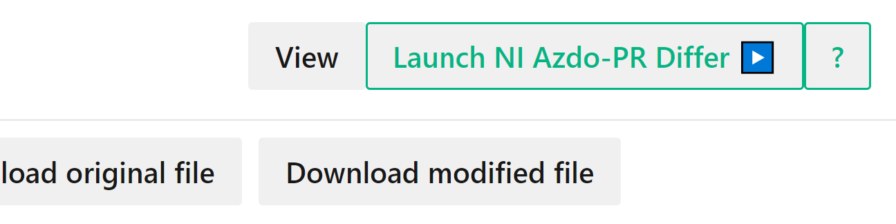

# NI-Azdo-PR-FileDiffTool

## Overview
This feature is used to differ TestStand .seq and LabVIEW .vi files from Azdo Pull Request. This will add a button to Azdo Pull Request and then by clicking on that button you will be able to diff the original and modified file in Diff/Compare tool of corresponding NI Software.

## Prerequisites
- Corresponding software i.e., LabVIEW or TestStand should be installed on the local machine.
- Supported Only on Windows OS.

## Getting Started
1. [Install the Violentmonkey extension](https://violentmonkey.github.io/) Or [Install the tampermonkey extension](https://www.tampermonkey.net/index.php)
2. Refresh this page if you just installed this extension (or the download link won't work)
3. [Install this userscript if violentmonkey is installed](https://github.com/sachin801/NI-Azdo-PR-FileDiffTool/raw/main/src/ViolentMonkeyScript/NI-Azdo-PR-Differ.user.js) or [Install this userscript if tampermonkey is installed](https://github.com/sachin801/NI-Azdo-PR-FileDiffTool/raw/main/src/ViolentMonkeyScript/NI-Azdo-PR-Differ-tamperMonkey.user.js)
4. [Click here to Download the application folder](https://minhaskamal.github.io/DownGit/#/home?url=https://github.com/sachin801/NI-Azdo-PR-FileDiffTool/tree/main/src/NIAzdoPRDiffer/NIAzdoPRDiffer/bin/Release/net6.0) and then extract the downloaded zip folder.
5. [Download this .reg file](https://github.com/sachin801/NI-Azdo-PR-FileDiffTool/blob/main/cfg/NIAzdoDiffRegEdit.reg).
6. Open the downloaded .reg file in any Editor i.e., (Notepad/ Notepad++) and Edit the following values:
   - Change the BrowserDownloadLocation value to the default download location of your browser on which you will view the PullRequest.
   - Change this value [C:\\NIAzdoPR\\NI-Azdo-PR-FileDiffTool\\src\\NIAzdoPRDiffer\\NIAzdoPRDiffer\\bin\\Release\\net6.0\\NIAzdoPRDiffer.exe] to the the absolute path of the application [NIAzdoPRDiffer.exe] present in the folder downloaded and then extracted as part of step 4.
7. Save the .reg file and then (double click on the .reg file OR right click on the file and then select Merge).
8. Open your browser and view the Pull request you will find that "Launch NI-Azdo PR Differ" button added to the files tab. Clicking on it will launch TestStand or LabVIEW files differ tool with diff between original and modified file.

Hope you have a better experience with this tool :blush:.   
